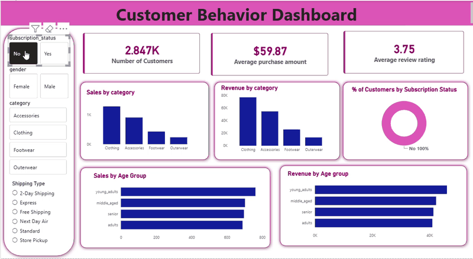

# 🛍️ Customer Behavior Data Analysis

## 📌 Project Overview

This project is an end-to-end retail customer behavior analysis project designed to transform raw customer shopping data into meaningful business insights.

The project follows a complete analytics workflow using **Python, SQL Server, and Power BI**, covering data preparation, exploratory analysis, business-focused SQL analysis, and interactive dashboard visualization.

---

## 🎯 Business Objective

The objective of this project is to analyze customer purchasing behavior and identify patterns related to:

- Customer spending
- Customer loyalty
- Subscription behavior
- Discounts and promotions
- Product performance
- Shipping preferences
- Customer demographics
- Purchase frequency

The analysis helps translate raw retail transaction data into insights that can support data-driven business decisions.

---

## 🛠️ Tools & Technologies

- **Python**
- **Pandas**
- **Jupyter Notebook**
- **SQL Server / SSMS**
- **SQL**
- **Power BI**
- **DAX**

---

## 🎥 Power BI Dashboard Walkthrough



The dashboard provides an interactive view of customer purchasing behavior, including customer KPIs, category analysis, age-group analysis, subscription behavior, and filtering by key customer attributes.


## 🔄 Project Workflow

```text
Raw Customer Data
       ↓
Python / Pandas
       ↓
Data Cleaning & Transformation
       ↓
Exploratory Data Analysis
       ↓
SQL Server
       ↓
Business Analysis
       ↓
Power BI
       ↓
Interactive Dashboard
       ↓
Business Insights


